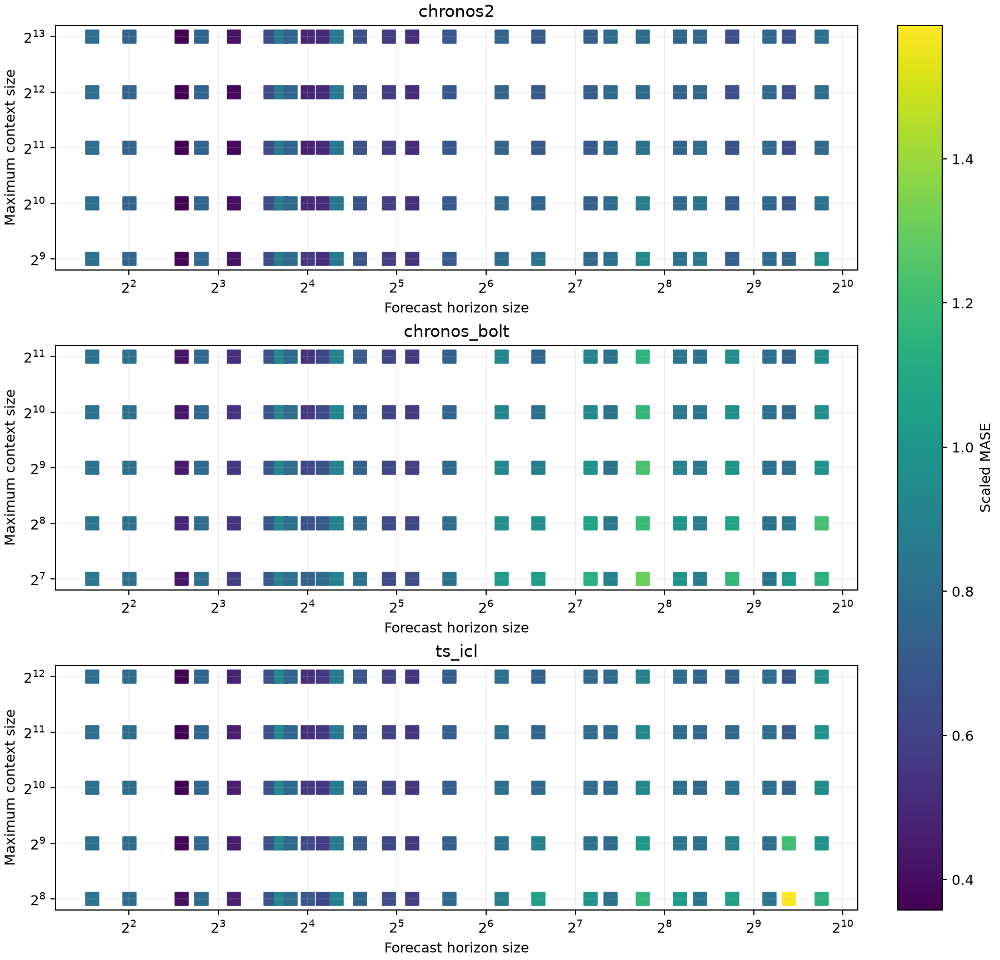

# Foundation-model benchmark summary

Each task MASE is divided by the matching Seasonal Naive MASE, then task ratios are combined with the TIME leaderboard geometric mean. Inference seconds are summed over the same test forecasting tasks; a blank total means at least one task lacks timing metadata.

| Model | Target mode | State | Exit | Scaled MASE (GM) | Inference seconds | Datasets | Tasks | Timed tasks | MASE finite/grid/total |
|---|---|---|---:|---:|---:|---:|---:|---:|---:|
| chronos2__model_config.context_length-4096 | multivariate,univariate | completed | 0 | 0.682427 | 252.458 | 50 | 98 | 98 | 111071/111071/111177 |
| chronos2__model_config.context_length-2048 | multivariate,univariate | completed | 0 | 0.683788 | 153.545 | 50 | 98 | 98 | 111071/111071/111177 |
| chronos2__model_config.context_length-8192 | multivariate,univariate | completed | 0 | 0.685489 | 425.830 | 50 | 98 | 98 | 111071/111071/111177 |
| chronos2__model_config.context_length-1024 | multivariate,univariate | completed | 0 | 0.701139 | 92.671 | 50 | 98 | 98 | 111071/111071/111177 |
| ts_icl__model_config.context_length-4096 | univariate | completed | 0 | 0.718394 | 2659.531 | 50 | 98 | 98 | 111071/111071/111177 |
| ts_icl__model_config.context_length-2048 | univariate | completed | 0 | 0.719896 | 1076.266 | 50 | 98 | 98 | 111071/111071/111177 |
| chronos2__model_config.context_length-512 | multivariate,univariate | completed | 0 | 0.727544 | 67.954 | 50 | 98 | 98 | 111071/111071/111177 |
| ts_icl__model_config.context_length-1024 | univariate | completed | 0 | 0.727673 | 474.670 | 50 | 98 | 98 | 111071/111071/111177 |
| chronos_bolt__model_config.context_length-2048 | univariate | completed | 0 | 0.759559 | 957.239 | 50 | 98 | 98 | 111071/111071/111177 |
| ts_icl__model_config.context_length-512 | univariate | completed | 0 | 0.765585 | 290.099 | 50 | 98 | 98 | 111071/111071/111177 |
| chronos_bolt__model_config.context_length-1024 | univariate | completed | 0 | 0.769732 | 584.993 | 50 | 98 | 98 | 111071/111071/111177 |
| chronos_bolt__model_config.context_length-512 | univariate | completed | 0 | 0.791436 | 396.230 | 50 | 98 | 98 | 111071/111071/111177 |
| chronos_bolt__model_config.context_length-256 | univariate | completed | 0 | 0.828627 | 317.732 | 50 | 98 | 98 | 111071/111071/111177 |
| ts_icl__model_config.context_length-256 | univariate | completed | 0 | 0.830410 | 230.829 | 50 | 98 | 98 | 111071/111071/111177 |
| chronos_bolt__model_config.context_length-128 | univariate | completed | 0 | 0.858084 | 286.476 | 50 | 98 | 98 | 111071/111071/111177 |

## Context size by forecast horizon

The figure places forecast horizon size on the x-axis and maximum context size
on the y-axis. Color is the geometric mean task MASE divided by the matching
Seasonal Naive MASE for each model/context/horizon-size cell.

